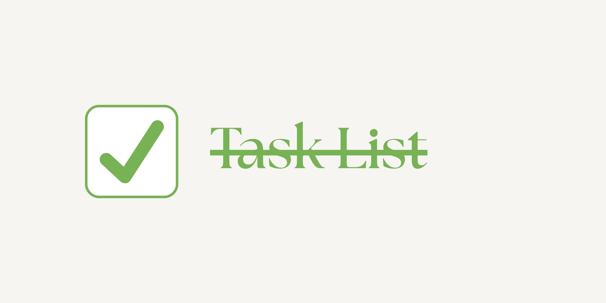

# Lista de Tareas

Este proyecto cumple con los siguientes requisitos:

- [x] Registrar nuevas tareas indicando la fecha y una breve descripción.
- [x] Visualizar las tareas registradas de manera clara.
- [x] Poder eliminar tareas que ya no sean necesarias.
- [x] Conservar las tareas para consultarlas más adelante, incluso si cierras el navegador.
- [x] Mostrar las tareas en orden cronológico.
- [x] Permitir filtrar o buscar tareas específicas.
- [x] Mostrar un contador con el total de tareas completadas y pendientes.

---

## Descripción Detallada del Funcionamiento

### 1. **index.html**
Archivo principal donde puedes **registrar nuevas tareas**.  
Contiene un formulario con los campos:
- Nombre de la tarea
- Fecha de vencimiento
- Descripción

Al enviar el formulario, la tarea se guarda en el Local Storage y se inicializa con estado "incomplete".

### 2. **js/index.js**
Este archivo gestiona el **registro de nuevas tareas**:
- Escucha el evento `submit` del formulario.
- Obtiene los datos ingresados.
- Genera una clave única para cada tarea (`task_1`, `task_2`, ...).
- Guarda la tarea en Local Storage en formato JSON.

### 3. **showtask.html**
Página para **visualizar y gestionar las tareas**:
- Muestra una tabla con todas las tareas guardadas.
- Incluye un formulario para buscar tareas por nombre y filtrar por estado (todas, completadas, incompletas).
- Muestra contadores de tareas totales, completadas e incompletas.

### 4. **js/variables.js**
Define las **variables globales** usadas en la gestión de tareas:
- Referencias al formulario de búsqueda, tabla, y elementos de contador.

### 5. **js/showtask.js**
Controla la **visualización, filtrado, búsqueda, orden y eliminación de tareas**:
- `filldata`: Obtiene todas las tareas del Local Storage.
- `filterfun`: Filtra tareas por estado.
- `searchfun`: Busca tareas por nombre.
- `sortdatabydate`: Ordena las tareas por fecha.
- `countstatus`: Cuenta tareas por estado.
- `updateCounters`: Actualiza los contadores en pantalla.
- Renderiza la tabla de tareas, mostrando el nombre, descripción, fecha, estado (editable con `<select>`) y botón para eliminar.
- Al cambiar el estado de una tarea, se actualiza el Local Storage y los contadores.
- Al eliminar una tarea, se elimina del Local Storage y de la tabla.

---

## ¿Cómo funciona?

1. **Registrar tarea:**  
   Ve a la página principal, llena el formulario y guarda la tarea. Se almacena en Local Storage.

2. **Visualizar tareas:**  
   Ve a "Ver Tareas". Se muestran todas las tareas en una tabla ordenada por fecha.

3. **Filtrar y buscar:**  
   Usa el formulario para buscar por nombre o filtrar por estado.

4. **Cambiar estado:**  
   Usa el `<select>` en la columna "Estado" para marcar una tarea como completada o incompleta. Los contadores se actualizan automáticamente.

5. **Eliminar tarea:**  
   Haz clic en el botón "Eliminar" para borrar la tarea de la lista y del Local Storage.

6. **Persistencia:**  
   Las tareas se mantienen guardadas aunque cierres el navegador, gracias al uso de Local Storage.

---

Este proyecto es una solución completa para la gestión de tareas en el navegador, con persistencia, filtros, búsqueda y contadores automáticos.
