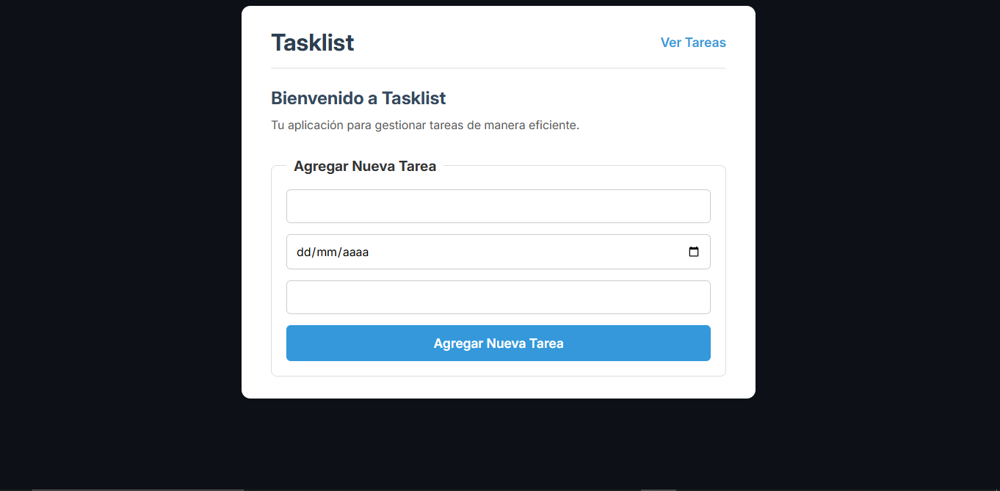
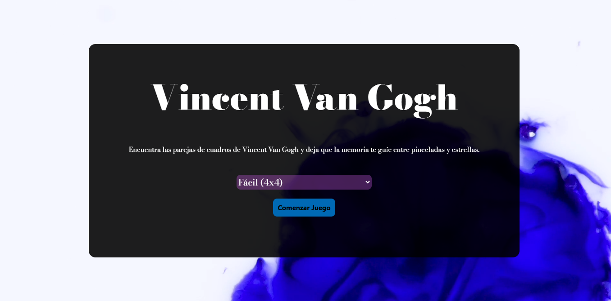
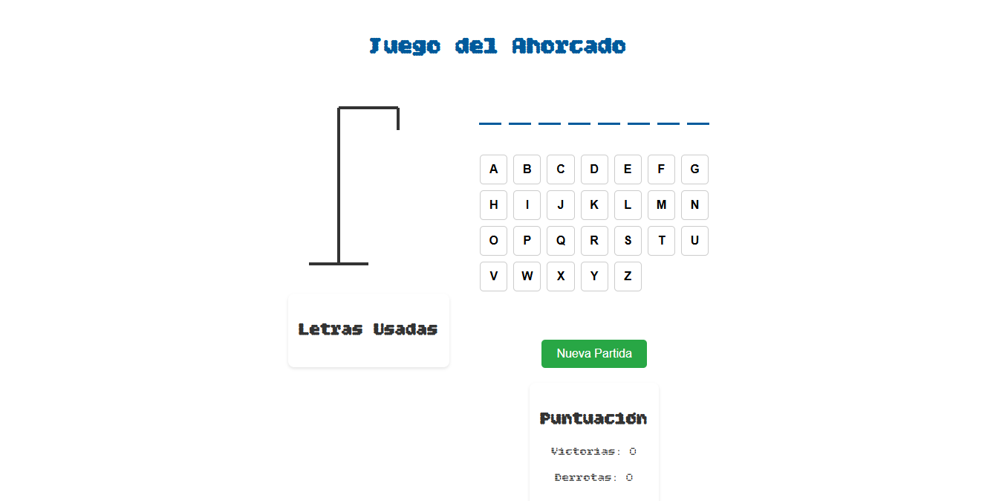

# 🚀 Taller practico de HTML, CSS y JS

Este repositorio contiene **tres aplicaciones diferentes**, cada una ubicada en su propia rama.  
La idea es explorar distintos retos de programación, desde aplicaciones de productividad hasta juegos clásicos.  

## 📌 Contenido
- 📝 [Historial de Tareas Diarias](#-historial-de-tareas-diarias)  
- 🎴 [Memorama](#-memorama)  
- 🔤 [Ahorcado](#-ahorcado)  

---

## 📝 Historial de Tareas Diarias
**Rama:** `tasklist`

Imagina que necesitas una aplicación sencilla para llevar un registro de las tareas que realizas en el día.  
Con esta app podrás:

- ➕ Registrar nuevas tareas indicando fecha y descripción.  
- 👀 Visualizar tus tareas en orden cronológico.  
- ❌ Eliminar las tareas que ya no necesites.  
- ✅ Diferenciar entre completadas y pendientes.  
- 🔍 Filtrar o buscar tareas específicas.  
- 📊 Ver un contador de tareas completadas y pendientes.  
- 💾 Guardar los datos en el navegador (persistencia local).  

📸 **Vista previa**:  


---

## 🎴 Memorama
**Rama:** `memorama`

Un pequeño juego de memoria visual con distintos niveles de dificultad.  
Características principales:

- 🔄 Cartas boca abajo que se voltean al hacer clic.  
- 🎯 Emparejar dos cartas iguales para mantenerlas descubiertas.  
- ⏱ Contador de tiempo y número de intentos.  
- 🏆 Registro del mejor tiempo y menor número de intentos.  
- 📈 Niveles de dificultad: **3x3**, **6x6**, **10x10**.  

📸 **Vista previa**:  


---

## 🔤 Ahorcado
**Rama:** `ahorcado`

Una versión digital del clásico juego del ahorcado.  
Incluye:

- ❓ Palabra oculta generada aleatoriamente.  
- ⌨️ Selección de letras con validación inmediata.  
- 🎭 Personaje que se va dibujando en cada error.  
- 🏁 Final del juego al adivinar la palabra o completar al personaje.  
- 📚 Historial de partidas con victorias y derrotas.  
- 🔡 Lista de letras ya usadas para evitar repeticiones.  
- 💾 Palabras almacenadas de manera persistente.  

📸 **Vista previa**:  


---

## 🚀 Cómo probar cada aplicación
1. Clona este repositorio:
   ```bash
   git clone <url-del-repo>
2. Cambiar de llama a la que se desee probar:
   ```bash
   git switch 'branch'
